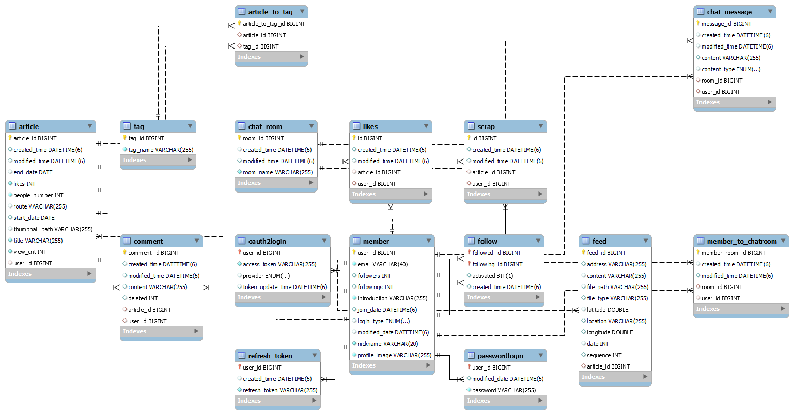
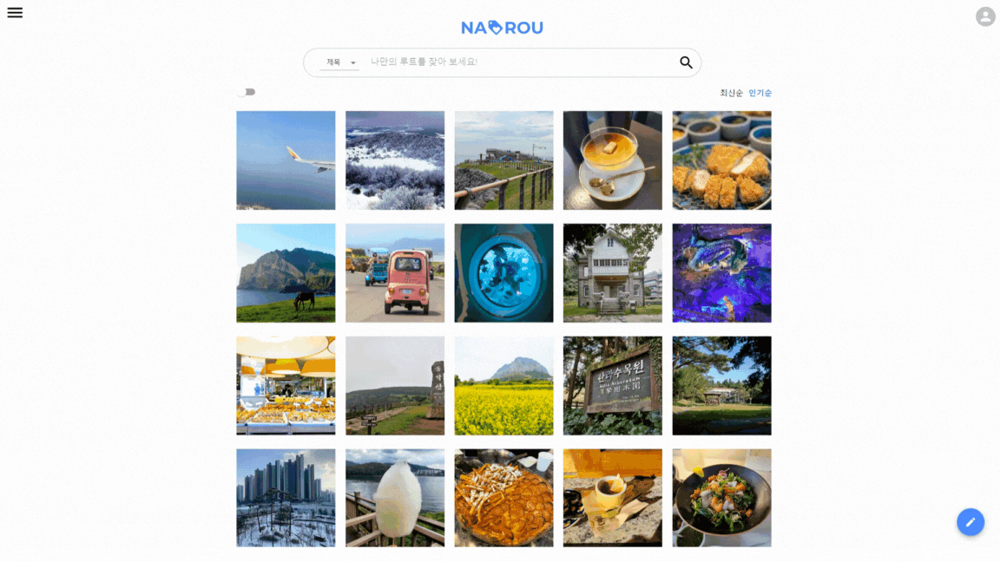
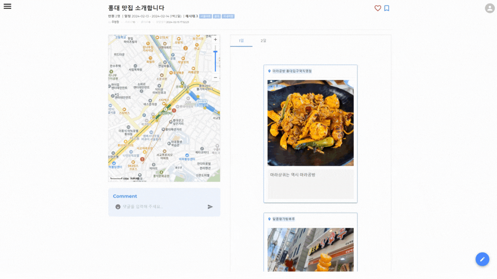
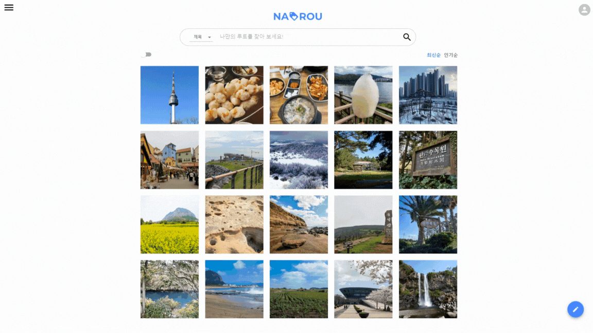

# NAROU 🧳
다른 사람들의 여행 경로를 한눈에 비교하고 싶나요? 🙋‍♀️
  
나만의 여행을 위한 효율적인 루트를 계획하고 실시간으로 공유 해 보세요! ✈

### 목차
1. [프로젝트 기간](#1-프로젝트-기간)
2. [사용한 기술 스택](#2-사용한-기술-스택)
3. [설계](#3-설계)
4. [주요 기능 설명](#4-주요-기능-설명)
5. [서비스 화면](#5-서비스-화면)

----

### 1. 프로젝트 기간
  - 2024.01.08 ~ 2024.02.16 (6주)

### 2. 사용한 기술 스택
  * Java
  * Spring boot
  * MySQL
  * Spring Security
  * Spring data JPA

### 3. 설계
* ERD
  <table>
    <tr>
      <td>
        
      </td>
    </tr>
  </table>

* FlowChart
  <table>
    <tr>
      <td>
        
      </td>
    </tr>
  </table>

### 4. 주요 기능 설명

  - 회원 관리
    - 멤버 회원가입/탈퇴, 중복 아이디 체크, 토큰 활용 인증, 인증코드 확인
    - 유저 닉네임 및 소개 조회/수정, 프로필 사진 등록/수정, 팔로우/팔로잉, 팔로우/팔로잉 목록 확인
    - 스크랩한 게시글 조회

  - 게시글 검색 및 필터 기능
    - 작성자, 제목으로 게시글 검색
    - 최신순, 인기순으로 게시글 정렬
    - 필터 조건을 설정하여 필터 검색
    - 사진 모드와 경로 모드로 게시글 조회
    - 무한스크롤

  - 게시글
    - 좋아요, 스크랩, 댓글
    - 태그 지정, 태그 기반 검색
    - 피드별 장소, 사진 등록(등록 시 Cropper로 줌 인/아웃 가능)
    - 피드 기반 경로 보여주기
    - 썸네일 등록

  - 비교
    - 두 게시글을 가져와 맵 상에서 경로 비교
    - 경로의 상세 정보 확인

### 5. 서비스 화면
* 메인페이지
  <table>
    <tr>
      <td>
        
      </td>
    </tr>
  </table>

* 무한스크롤
  <table>
    <tr>
      <td>
        
      </td>
    </tr>
  </table>

* 검색
  <table>
    <tr>
      <td>
        
      </td>
    </tr>
  </table>

* 게시글 작성
  <table>
    <tr>
      <td>
        
      </td>
    </tr>
  </table>

* 프로필
  <table>
    <tr>
      <td>
        
      </td>
    </tr>
  </table>

* 스크랩
  <table>
    <tr>
      <td>
        
      </td>
    </tr>
  </table>

* 비교
  <table>
    <tr>
      <td>
        
      </td>
    </tr>
  </table>
